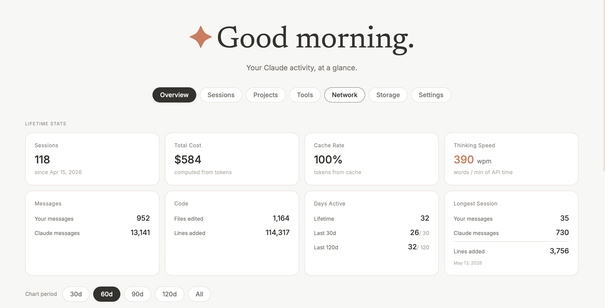

# claude-code-stats



A local dashboard for your Claude Code usage — sessions, costs, tool calls, network activity, and more. Reads `~/.claude` directly, nothing leaves your machine.

## Install

Download the latest binary from [Releases](../../releases):

```bash
./claude-stats-macos-arm64   # Apple Silicon
./claude-stats-macos-amd64   # Intel Mac
./claude-stats-linux-amd64   # Linux
```

Opens at **http://localhost:6967**.
